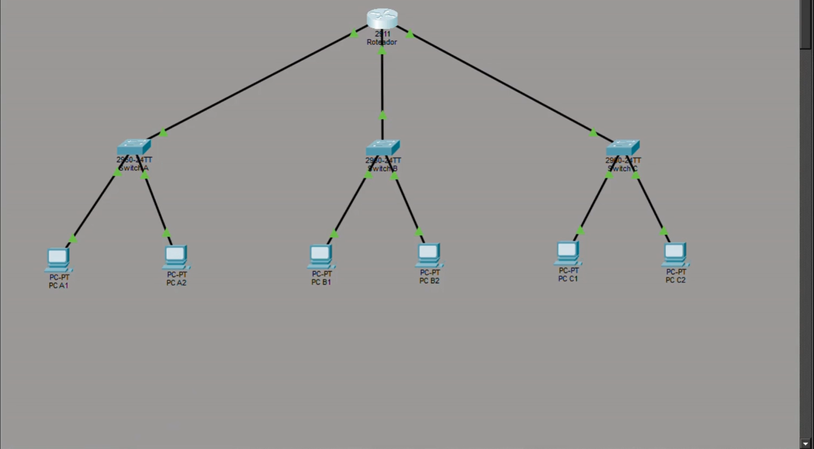
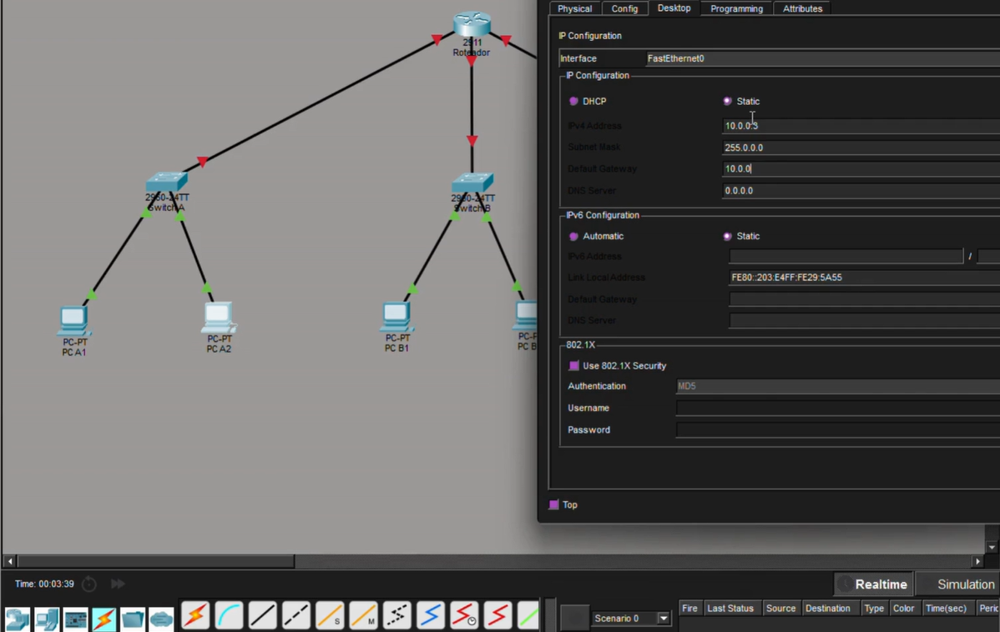
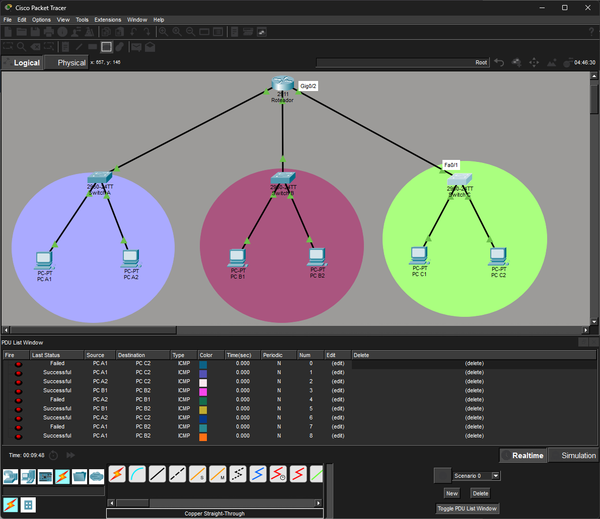

# Comunicação entre 3 Redes Distintas

### Cisco Packet Tracer • IPv4 • Routing • ICMP

> Laboratório prático desenvolvido durante a formação em Cibersegurança do **Programa Mulher Digital**, utilizando o Cisco Packet Tracer para compreender como diferentes redes podem se comunicar por meio de roteamento.

---

## Visão geral

Neste laboratório, foi criado um cenário com **três redes IP distintas**, conectadas a um roteador central.

A proposta foi configurar os dispositivos para permitir a comunicação entre redes diferentes e validar essa comunicação por meio do **ICMP (ping)**.

|    Componente      |    Configuração     |
| ------------------ | ------------------- |
| Simulador          | Cisco Packet Tracer |
| Roteador           | Cisco 2911          |
| Switches           | 3 × Cisco 2960      |
| Computadores       | 6 PCs               |
| Endereçamento      | IPv4                |
| Protocolo de teste | ICMP                |
| Roteamento         | Entre 3 redes       |

---

##  Topologia

A rede foi estruturada com três segmentos diferentes, cada um conectado a um switch. Os três switches foram conectados a um **roteador central**, responsável pela comunicação entre as redes.

### Estrutura

```text
                    ┌─────────────────┐
                    │    ROTEADOR     │
                    │     CENTRAL     │
                    └───────┬─────────┘
                            │
             ┌──────────────┼──────────────┐
             │              │              │
             ▼              ▼              ▼
        ┌─────────┐    ┌─────────┐    ┌─────────┐
        │ Switch A│    │ Switch B│    │ Switch C│
        └────┬────┘    └────┬────┘    └────┬────┘
             │              │              │
          PC A1           PC B1           PC C1
          PC A2           PC B2           PC C2
```

### 📸 Topologia no Packet Tracer



---

##  Endereçamento IPv4

Cada rede recebeu uma faixa de endereçamento diferente.

| Rede   | Dispositivo | Endereço IP   | Máscara         | Gateway       |
| ------ | ----------- | ------------- | --------------- | ------------- |
| Rede A | PC A1       | `10.0.0.2`    | `255.0.0.0`     | `10.0.0.1`    |
| Rede A | PC A2       | `10.0.0.3`    | `255.0.0.0`     | `10.0.0.1`    |
| Rede B | PC B1       | `172.16.0.2`  | `255.255.0.0`   | `172.16.0.1`  |
| Rede B | PC B2       | `172.16.0.3`  | `255.255.0.0`   | `172.16.0.1`  |
| Rede C | PC C1       | `192.168.1.2` | `255.255.255.0` | `192.168.1.1` |
| Rede C | PC C2       | `192.168.1.3` | `255.255.255.0` | `192.168.1.1` |

> As faixas utilizadas representam, para fins didáticos do exercício, redes tradicionalmente associadas às classes A, B e C.

### 📸 Configuração de IP

Abaixo, uma das configurações de endereço IPv4 realizada nos dispositivos:



---

##  Configuração realizada

Durante o laboratório foram realizados os seguintes procedimentos:

1. Montagem da topologia no Cisco Packet Tracer.
2. Conexão dos computadores aos respectivos switches.
3. Configuração dos endereços IPv4.
4. Definição das máscaras de sub-rede.
5. Configuração dos gateways padrão.
6. Configuração das interfaces do roteador para as três redes.
7. Teste de comunicação entre dispositivos de redes diferentes.

---

##  Fluxo de comunicação

Um dos testes realizados utilizou o seguinte caminho:

```text
PC A1
 ↓
Switch A
 ↓
Roteador
 ↓
Switch C
 ↓
PC C1
```

Nesse cenário, o pacote precisa passar pelo roteador porque **PC A1 e PC C1 pertencem a redes IP diferentes**.

---

##  Teste de conectividade

Para verificar a comunicação entre as redes, foi utilizado o comando `ping`, baseado no protocolo **ICMP**.

### Teste realizado

```text
Origem:   PC A1
IP:       10.0.0.2

Destino:  PC C1
IP:       192.168.1.2
```

### 📸 Resultado do teste



O primeiro envio apresentou uma falha durante a simulação. Após o processo de descoberta e atualização das informações necessárias para a comunicação, os pacotes seguintes foram enviados com sucesso.

### ✅ Resultado

**Comunicação estabelecida entre dispositivos de redes diferentes.**
---

##  O arquivo desse projeto .pkt está disponível para visualização.

---

##  Principais aprendizados

Este laboratório ajudou a compreender, na prática:

* Endereçamento IPv4;
* Máscara de sub-rede;
* Gateway padrão;
* Diferença entre switch e roteador;
* Comunicação entre redes diferentes;
* Funcionamento básico do roteamento;
* Utilização do `ping` para testar conectividade;
* Funcionamento do ICMP;
* Processo de descoberta de endereços utilizando ARP;
* Identificação de possíveis falhas durante um teste de conectividade.

---

##  Competências praticadas

`IPv4` · `Redes de Computadores` · `Endereçamento IP` · `Subnet Mask` · `Gateway` · `Switching` · `Routing` · `ICMP` · `ARP` · `Cisco Packet Tracer` · `Troubleshooting`

---

## 🎥 Apresentação

Vídeo relacionado à apresentação deste laboratório foi feita em grupo e está disponível no Youtube:

**Link:** https://youtu.be/Z2j3y9h8_Ro

---

##  Contexto

Este laboratório foi desenvolvido como parte das atividades práticas da formação em **Cibersegurança do Programa Mulher Digital**, utilizando conteúdos e ferramentas da **Cisco Networking Academy**.

A atividade contribui para a construção dos fundamentos de **Redes de Computadores**, conhecimentos importantes para a continuidade dos estudos em **Cibersegurança e Segurança da Informação**.

---

##  Arquitetura

```text
📁 portfolio
├── 📁 comunicacao-redes-distintas
│   ├── 📁 imagens
│   │   ├── topologia.png
│   │   ├── configuracao-ip.png
│   │   └── teste-conexao.png
│   ├── laboratório-aula-7-comunicacao-redes-distintas.pkt
│   └── README.md
└── 📁 próximos-laboratórios

##  Próximos laboratórios

Este projeto faz parte de uma sequência de atividades práticas que serão adicionadas ao portfólio conforme o avanço dos estudos.

```
